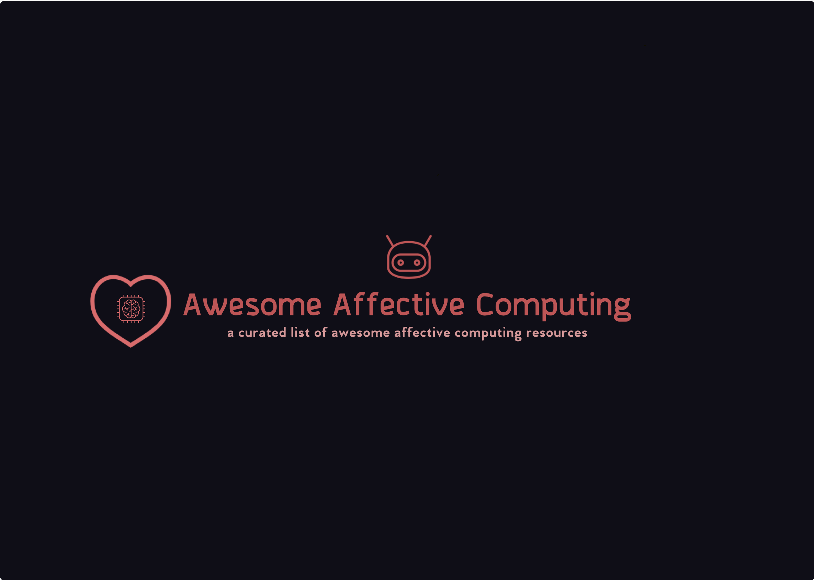

<h1 align=center> Awesome Affective Computing </h1>

	

	
	

# Contents

- [Papers](#papers)
- [Software](#software)

## Papers

- [Affective Computing](https://affect.media.mit.edu/pdfs/95.picard.pdf)
- [Theories, Methods and Current Research on Emotions](https://irenelopatovska.files.wordpress.com/2012/10/lopatovska_arapakis_2011_theories.pdf)